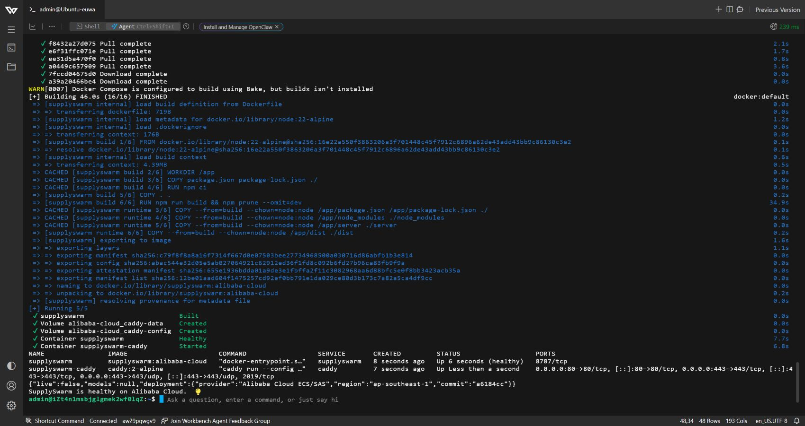
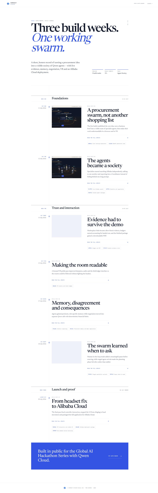

# Alibaba Cloud deployment proof

SupplySwarm's production backend is packaged for **Alibaba Cloud ECS / Simple Application Server** in [`deploy/alibaba-cloud/docker-compose.yml`](../deploy/alibaba-cloud/docker-compose.yml). The container runs the complete Express API, WebSocket phone companion, frontend, persistent agent memory, and Qwen Cloud client.

## Public deployment

The Alibaba Cloud instance is deployed and was independently checked from London on 20 July 2026. Cloudflare provides the public certificate and proxy; Caddy terminates HTTPS on the Alibaba origin and forwards traffic to the SupplySwarm container.

| Evidence | Value |
|---|---|
| Alibaba Cloud service | Simple Application Server (Ubuntu 24.04, 2 vCPU, 2 GiB) |
| Region | Singapore (`ap-southeast-1`) |
| Public application | [https://supplyswarm.shroozy.com](https://supplyswarm.shroozy.com) |
| Build journal | [https://supplyswarm.shroozy.com/journal/](https://supplyswarm.shroozy.com/journal/) |
| Public health endpoint | [https://supplyswarm.shroozy.com/api/health](https://supplyswarm.shroozy.com/api/health) |
| Deployed commit | [`a6184cc`](https://github.com/teawa-b/QwenHackathon-2/commit/a6184cc) |
| Workbench proof screenshot | [`docs/images/alibaba-workbench-proof.png`](images/alibaba-workbench-proof.png) |

## Code evidence

- [`deploy/alibaba-cloud/docker-compose.yml`](../deploy/alibaba-cloud/docker-compose.yml) — Alibaba-specific production runtime, region and provider metadata, persistent memory volume, and health check.
- [`deploy/alibaba-cloud/Caddyfile`](../deploy/alibaba-cloud/Caddyfile) — automatic HTTPS and reverse proxy for the branded public domain.
- [`deploy/alibaba-cloud/bootstrap.sh`](../deploy/alibaba-cloud/bootstrap.sh) — idempotent Ubuntu bootstrap used by Alibaba Cloud Command Assistant or Workbench.
- [`Dockerfile`](../Dockerfile) — reproducible multi-stage Node.js production image.
- [`server/qwen.js`](../server/qwen.js) — direct Qwen Cloud / DashScope API integration for planning, grounded search, ASR, and image generation.
- [`server/index.js`](../server/index.js) — public deployment metadata and health route plus the agent API and WebSocket-backed application server.

## Verification response

The Alibaba instance sets `DEPLOYMENT_PROVIDER`, `DEPLOYMENT_REGION`, and `DEPLOYMENT_COMMIT`. `/api/health` exposes those non-secret values so judges can verify the deployed runtime without revealing credentials. The current Alibaba instance deliberately has no DashScope secret installed, so it reports `live: false` and runs the honestly labelled demo catalogue. The separate judge-facing Qwen demo remains available at [qwenhackathon-2-production.up.railway.app](https://qwenhackathon-2-production.up.railway.app).

The public journal and health endpoint both returned HTTP 200 after the final deployment.
