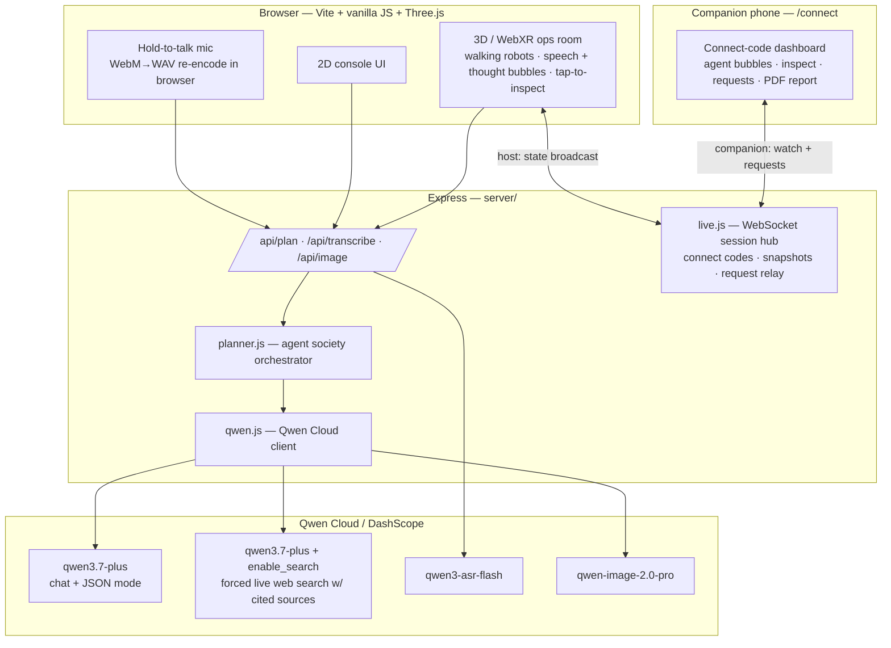
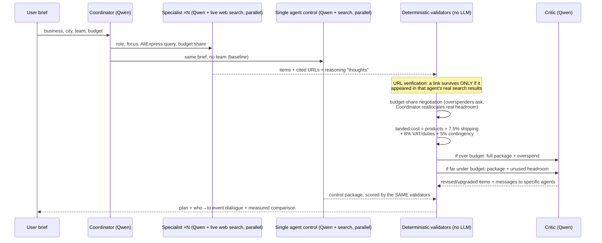

# SupplySwarm — Architecture

SupplySwarm is a multi-agent procurement system (**Track 3: Agent Society**). A user describes a business in one sentence (typed, or spoken to a 3D robot); a society of Qwen-powered agents decomposes the task, searches AliExpress live, negotiates over a shared budget, resolves conflicts, and returns an evidence-linked equipment package — measured against a single-agent control on every run.

## System overview



## Connect-code companion (server/live.js, src/connect.js)

The 3D/VR room registers as a **host** over WebSocket and receives a 5-letter code (unambiguous alphabet, no 0/O/1/I). Phones join at `/connect` as **companions**: the server holds a per-session snapshot (brief, agents with their Qwen reasoning, dialogue events, plan, concept image, requests) so late joiners and reconnects catch up instantly, then relays every host update live. Companions send **requests** addressed to a specific agent or the Hub; the server fans them out to the host — where the target robot turns to the viewer and shows the message as an orange bubble — and echoes them to every other companion. Hardening: payload caps, JSON validation, unknown message types dropped (never rebroadcast), 8 companions/session, 200 sessions, 2 h TTL with a 5-minute host-reconnect grace, 30 s keepalive pings. The **PDF report** (jspdf, lazy-loaded chunk — downloadable from the companion and from the main results page) embeds the concept image via a server-side proxy locked to DashScope's OSS host, avoiding canvas tainting without loosening CORS.

## The agent society (server/planner.js)

One `/api/plan` request runs a full multi-agent pipeline. Each box is a **separate Qwen call with its own role prompt**; specialists and the control run execute **concurrently**.



### Task decomposition & role assignment
The **Coordinator** call returns a bespoke team for *this* brief: per-agent code/name/focus, a concrete AliExpress search query, and a **share of the budget** (shares normalised server-side). Supplier-verification and Critic agents are appended with fixed roles.

### Live sourcing with verified links
Each specialist runs `enable_search: true, search_options: { forced_search, enable_source }` — Qwen performs a real web search and the API returns the **actual result URLs** it saw. The planner enforces: *a cited link survives only if it appeared in that agent's own search results and is on aliexpress.com or alibaba.com*. Verified lines are labelled **“Live AliExpress listing”** / **“Live Alibaba listing”**; everything else is downgraded to a labelled estimate. No displayed link can be fabricated.

### Dialogue, disagreement, conflict resolution
Every event is `who → to` dialogue, replayed in the console and acted out in 3D:
- **Supplier vetoes** — cited URLs not present in the search results are rejected on-screen.
- **Budget negotiation** — a specialist that overshoots its share requests more; the Coordinator reallocates *real* headroom from an underspender, or refuses and escalates to the Critic.
- **Critic revision** — over-budget packages are revised and heavily underspent packages are upgraded toward the ceiling; the Critic messages the specific agents whose lines it changed. Revision passes may only reuse URLs that survived the sourcing round.

### Measured efficiency vs single agent
A solo Qwen agent with **identical tools** runs concurrently as a control. Both packages are scored by the **same deterministic validators**: verified links, item coverage, landed-cost budget validity, wall-clock seconds — plus the measured parallel-sourcing speed-up (Σ specialist durations ÷ wall time). The results page shows the live scorecard; nothing is scripted.

### Deterministic core (the LLM never does arithmetic)
Landed cost (shipping, VAT/duties, contingency), budget validation, share normalisation, URL verification, and negotiation arithmetic are plain code in `planner.js` — auditable and un-hallucinatable.

## Qwen Cloud API usage

| Capability | Model | Where |
|---|---|---|
| Role-prompted JSON planning (Coordinator, Critic) | `qwen3.7-plus`, `response_format: json_object` | `qwen.js: chatJSON` |
| **Live web search with cited sources** (specialists, control) | `qwen3.7-plus` + `enable_search`/`forced_search`/`enable_source` | `qwen.js: chatJSONWithSearch` |
| Voice briefs (hold-to-talk, desktop + VR controller) | `qwen3-asr-flash` (browser re-encodes to 22.05 kHz mono WAV) | `qwen.js: transcribe` |
| Concept image of the finished business | `qwen-image-2.0-pro` | `qwen.js: generateImage` |

## 3D / VR / passthrough-AR ops room (src/xr-room.js)

Three.js scene, lazy-loaded; WebXR `immersive-vr` **and** `immersive-ar` on Quest-class devices.
- **Passthrough AR with surface detection** — the AR session requests `hit-test` (required) plus `plane-detection` and `anchors` (optional). The camera feed shows through (`alpha` renderer, background/fog dropped, virtual floor hidden); a reticle tracks real surfaces via per-frame hit-test poses; the first trigger pull decomposes the hit pose and sets a 0.42-scale miniature of the entire ops room onto the detected floor/desk, auto-rotated to face the viewer. All scene content lives in a single `world` group, so placement is one transform and every behaviour below works identically in AR, VR and desktop. Implemented with native WebXR APIs — the same features XR Blocks' `World` module wraps — with zero added dependencies.
- Robots **beam in when they first speak** and *act out* the event stream: the speaker **walks toward whoever it addresses**, faces them, shows a **speech bubble** with the actual message, and fires a message pulse along an agent-to-agent line; the listener nods.
- Between events, agents surface **thought bubbles** (dashed, italic) containing their **genuine Qwen reasoning steps** returned by each specialist call — the swarm's thinking is visualised, not decorated.
- **Interactive**: tap any robot (or point a VR controller and pull the trigger) to inspect it — it turns to you and reports its role, sourced lines and spend. Hold the centre Coordinator to speak your brief.
- Idle agents drift and scan near their stations; all geometry, materials and canvas textures are disposed on exit.

## Error handling & honesty
- Per-call timeouts; specialist failures degrade to explicit events + risks ("live search failed for X"), never a crash.
- The whole live pipeline failing falls back to a clearly-labelled demo catalogue — demo data is never presented as live.
- Payload validation on every route (size caps, WAV header check, text limits); typed `QwenError` → correct HTTP codes.
- Every LLM output is schema-cleaned (type coercion, length caps, enum checks) before it touches the UI.

## Module map

```
server/qwen.js      Qwen Cloud client: chat-JSON, chat-JSON+web-search, ASR, image
server/planner.js   Agent society: coordinator → parallel specialists+control →
                    negotiation → landed cost → critic; scoring & event stream
server/live.js      WebSocket hub: connect codes, session snapshots, request relay
server/index.js     Express routes, image proxy, static hosting, error envelope
src/app.js          Views (brief/ops/results), voice recorder, API client, routing
src/xr-room.js      Three.js/WebXR room: bots, dialogue acting, thoughts, inspect,
                    passthrough AR placement, phone-request bubbles
src/live.js         WebSocket client links (host + companion, auto-reconnect)
src/connect.js      /connect companion dashboard (lazy-loaded chunk)
src/pdf.js          Branded PDF report via jspdf (lazy-loaded chunk)
```

## Scaling & productisation
The planner is stateless — horizontal scale is trivial. The specialist layer fans out per category, so richer teams cost latency ≈ the slowest search, not the sum. Marketplace adapters (the AliExpress query + URL-verification policy) are isolated, so adding Amazon Business / Made-in-China is a prompt + hostname-allowlist change. The verified-link policy generalises to any grounded-citation agent product.
